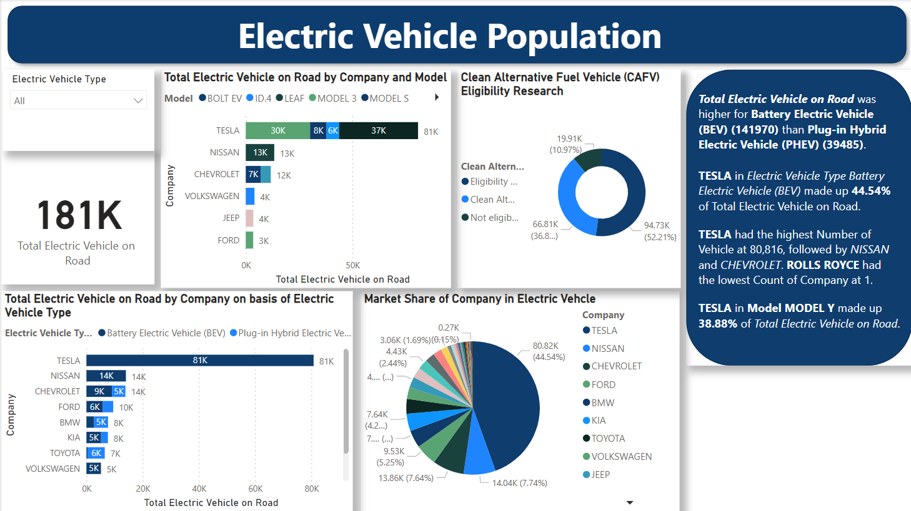
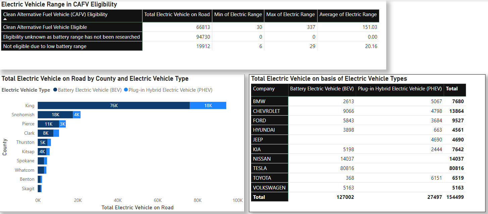
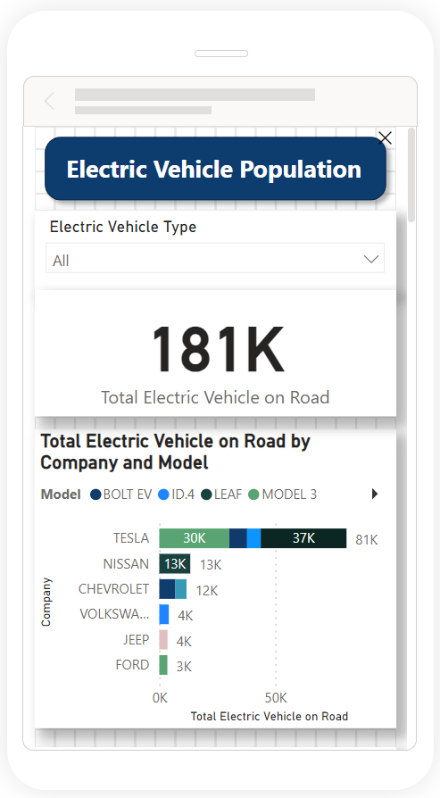
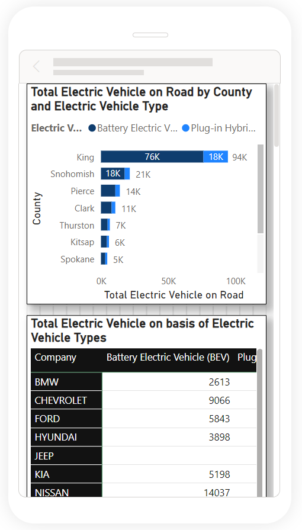

# Electric Vehicle Population
 Analyse the Electric Vehicle Population datasets and create understandable insight. This dataset shows the *Battery Electric Vehicles (BEVs)* and *Plug-in Hybrid Electric Vehicles (PHEVs)* that are currently registered through Washington State Department of Licensing (DOL).

## Datasets

Download Dataset -> [catalog.data.gov](https://catalog.data.gov/dataset/electric-vehicle-population-data)

This dataset is provided by **Washington State Department of Licensing**

Last Update is **April 19, 2024**

Details About this Dataset -> [data.wa.gov/Transportation/Electric-Vehicle-Population-Data](https://data.wa.gov/Transportation/Electric-Vehicle-Population-Data/f6w7-q2d2/about_data)

## Tools - Microsoft Power BI Desktop

- Microsoft Power BI Desktop is built for the analyst. It combines state-of-the-art interactive visualizations, with industry-leading data query and modeling built-in. 
- Create and publish your reports to Power BI. Power BI Desktop helps you empower others with timely critical insights, anytime, anywhere.

Download Microsoft Power BI Desktop from here -> [Link](https://www.microsoft.com/en-us/download/details.aspx?id=58494)

## Interactive Visual

### Desktop View

### Mobile View

